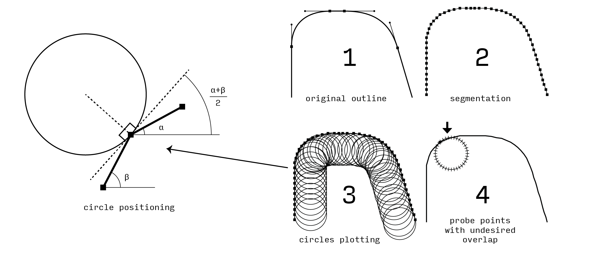

# CAM Simulator

## Visualize CNC limitations right in the glyph editor. [RoboFont](https://robofont.com) extension available on [Mechanic 2](https://robofontmechanic.com)

The CAM Simulator is a RoboFont extension that I developed during type]media to simplify the design of a CNC optimized typeface.

The extension has been updated to RoboFont 4, and it makes use of all the cool new APIs: [Merz](https://typesupply.github.io/merz/) and [Subscriber](https://robofont.com/documentation/topics/subscriber/). [Here](https://bitbucket.org/rarista/cam-simulator/src/a4340f885bf670677f22ab79a267f42f020b6da9/CAM%20simulator.py) you can find the original version.

Basic CNC milling machines make use of  a classic 3-axes plotter structure and of a router mounted on the moving head of the plotter. They are pantographs driven by a computer. The plotter movements freedom is fixed to a relation of 90° between each rail: it is not possible to perform undercuts.

The most important aspect, with an impact on a type design level, is that a router is basically a cutting tool fixed on the shaft of an electric motor. Whatever 
the cutting tool shape will be the minimum output will be circular and easy 
to see with the human eye.

The "inner mechanisms" of the extension are explained in the following diagram.

The process is quite intensive, so it is normal to feel a bit of slowdown in the editor. You can turn off the preview to stop the calculation. You could run the tool on several glyph editors, but you'll probably need a quantum computer to run things smoothly.